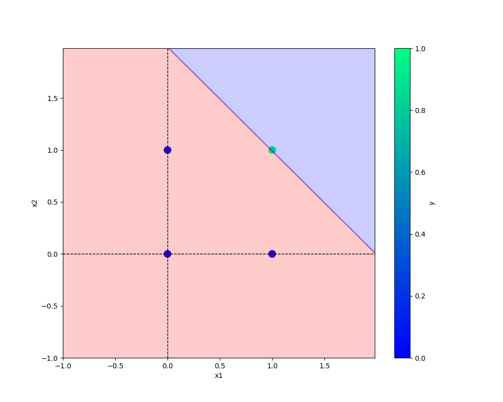

# oneNeuron
oneNeuron | Perceptron

# Perceptron implementation
AND and OR implimented within 10 epochs
XOR tried with different learning rates and epochs, but implementation not working out.

## commands

## Add URL -
[Git handbook](https://guides.github.com/introduction/git-handbook/)

## Add image -

